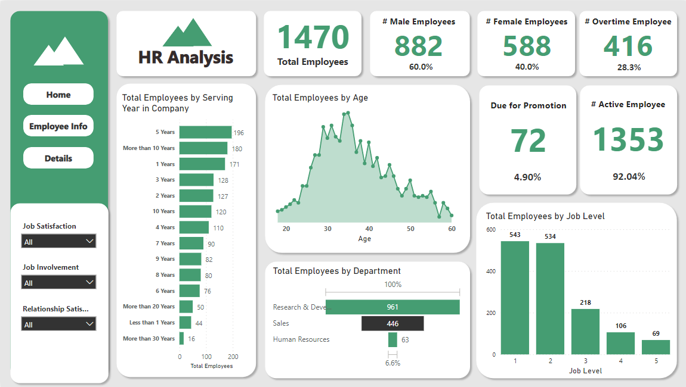

# Data Analysis & Visualization
This repository contain various types of datasets (with source link) and the Power BI Reports and Dashboard.
- [@awmium](https://www.github.com/awmium)

## Projects

## Screenshots

